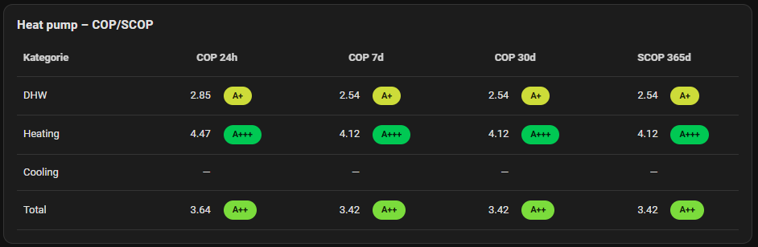

# COP/SCOP Card

[](https://github.com/VitisEK/cop-scop-card/releases)
[](https://github.com/hacs/integration)
[](LICENSE)
[](https://github.com/VitisEK)
[](https://community.home-assistant.io)

A custom Lovelace card for Home Assistant that calculates and displays **COP** (Coefficient of Performance) and **SCOP** (Seasonal Coefficient of Performance) for heat pumps.

It uses Home Assistant's **Long-Term Statistics** to calculate efficiency over different periods (24h, 7 days, Month, Year) and supports auxiliary heaters, energy classes, and multiple categories (Heating, Cooling, DHW).

## Table preview


## Detail preview


## Features

*   **Real-time Calculation**: Calculates COP/SCOP dynamically from produced heat and consumed energy entities.
*   **Multiple Periods**: Displays statistics for 24h, 7 days, Month (configurable days), and Year (configurable days).
*   **Auxiliary Heaters**: Supports adding auxiliary heater consumption (e.g., electric back-up) to the calculation. Can handle cases where the aux heater is already included in the main sensor or separate.
*   **Energy Classes**: Visualizes efficiency classes (A+++ to G) based on custom thresholds or EU standards (ETA_s).
*   **Two Modes**:
    *   **Single**: Detailed view with tiles for a specific category.
    *   **Table**: Overview of all categories (Heating, DHW, Cooling, Total) in a compact table.
*   **Visual Editor**: Fully configurable via the Lovelace UI editor.

## Installation

### HACS (Recommended)

1.  Open **HACS** in Home Assistant.
2.  Go to **Frontend**.
3.  Click the menu (three dots) in the top right corner -> **Custom repositories**.
4.  Add the URL of this repository: `https://github.com/VitisEK/cop-scop-card`.
5.  Select category: **Lovelace**.
6.  Click **Add** and then install the card.
7.  Reload resources (or restart HA).

### Manual Installation

1.  Download `cop-scop-card.js` from the Releases page.
2.  Upload the file to your Home Assistant `config/www/` directory.
3.  Add the resource in **Settings** -> **Dashboards** -> **Three dots** -> **Resources**:
    *   URL: `/local/cop-scop-card.js`
    *   Type: `JavaScript Module`

## Usage

### Basic (single category)

```yaml
type: custom:cop-scop-card
title: Heat Pump - COP/SCOP
mode: single
categories:
  - key: heating
    name: Heating
    enabled: true
    produced_entity: sensor.hp_heat_produced
    consumed_entity: sensor.hp_heat_consumed
```

### Table overview (multiple categories)

```yaml
type: custom:cop-scop-card
title: Heat Pump Overview
mode: table
categories:
  - key: heating
    name: Heating
    enabled: true
    produced_entity: sensor.hp_heat_produced
    consumed_entity: sensor.hp_heat_consumed
  - key: dhw
    name: Hot Water
    enabled: true
    produced_entity: sensor.hp_dhw_produced
    consumed_entity: sensor.hp_dhw_consumed
  - key: cooling
    name: Cooling
    enabled: false
    produced_entity: sensor.hp_cooling_produced
    consumed_entity: sensor.hp_cooling_consumed
  - key: total
    name: Total
    enabled: true
    produced_entity: sensor.hp_total_produced
    consumed_entity: sensor.hp_total_consumed
```

### With auxiliary heater (separate entity)

```yaml
type: custom:cop-scop-card
title: Heat Pump + Aux
mode: single
categories:
  - key: heating
    name: Heating
    enabled: true
    produced_entity: sensor.hp_heat_produced
    consumed_entity: sensor.hp_heat_consumed
    aux_entity: sensor.aux_heater_energy
    aux_included: false
```

### Total with two aux entities

```yaml
type: custom:cop-scop-card
title: Total Including Aux
mode: single
categories:
  - key: total
    name: Total
    enabled: true
    produced_entity: sensor.hp_total_produced
    consumed_entity: sensor.hp_total_consumed
    aux_entity: sensor.aux_heater_heating_energy
    aux_entity2: sensor.aux_heater_dhw_energy
    aux_included: false
```

### EU class mode (space heating)

```yaml
type: custom:cop-scop-card
title: EU Classes
mode: table
show_classes: true
class_mode: eu_space_heating
categories:
  - key: heating
    name: Heating
    enabled: true
    produced_entity: sensor.hp_heat_produced
    consumed_entity: sensor.hp_heat_consumed
```

### Custom thresholds and colors

```yaml
type: custom:cop-scop-card
title: Custom Classes
show_classes: true
class_mode: custom
custom_class_thresholds:
  A+++: 4.7
  A++: 4.2
  A+: 3.6
  A: 3.1
  B: 2.6
  C: 2.2
  D: 1.9
  E: 1.6
  F: 1.3
  G: 0.0
class_colors:
  A+++: '#00c853'
  A++: '#64dd17'
  A+: '#cddc39'
  A: '#ffeb3b'
  B: '#ffc107'
  C: '#ff9800'
  D: '#ff5722'
  E: '#f44336'
  F: '#d32f2f'
  G: '#9e9e9e'
categories:
  - key: heating
    name: Heating
    enabled: true
    produced_entity: sensor.hp_heat_produced
    consumed_entity: sensor.hp_heat_consumed
```

### Custom month/year ranges

```yaml
type: custom:cop-scop-card
title: Custom Periods
month_days: 21
year_days: 300
categories:
  - key: heating
    name: Heating
    enabled: true
    produced_entity: sensor.hp_heat_produced
    consumed_entity: sensor.hp_heat_consumed
```

## Configuration

The card supports the visual editor. Simply add the "COP/SCOP Card" to your dashboard and configure it via the UI.

### YAML Configuration

```yaml
type: custom:cop-scop-card
title: Heat Pump Stats
mode: single # 'single' or 'table'
refresh_minutes: 60
show_classes: true
class_mode: custom # 'custom', 'eu_space_heating', 'eu_space_heating_lowtemp'
categories:
  - key: heating
    name: Heating
    enabled: true
    produced_entity: sensor.heat_pump_heating_energy_produced
    consumed_entity: sensor.heat_pump_heating_energy_consumed
    aux_entity: sensor.aux_heater_energy
    aux_included: false # Set to true if consumed_entity already includes aux_entity
  - key: dhw
    name: Hot Water
    enabled: true
    produced_entity: sensor.heat_pump_dhw_energy_produced
    consumed_entity: sensor.heat_pump_dhw_energy_consumed
  - key: total
    name: Total
    enabled: true
    consumed_entity: sensor.heat_pump_total_energy_consumed
    aux_entity: sensor.aux_heater_heating_energy # e.g. aux for heating
    aux_entity2: sensor.aux_heater_dhw_energy # e.g. aux for DHW
```

## Support

If you run into issues or have a feature request, please open an issue here:
https://github.com/VitisEK/cop-scop-card/issues
